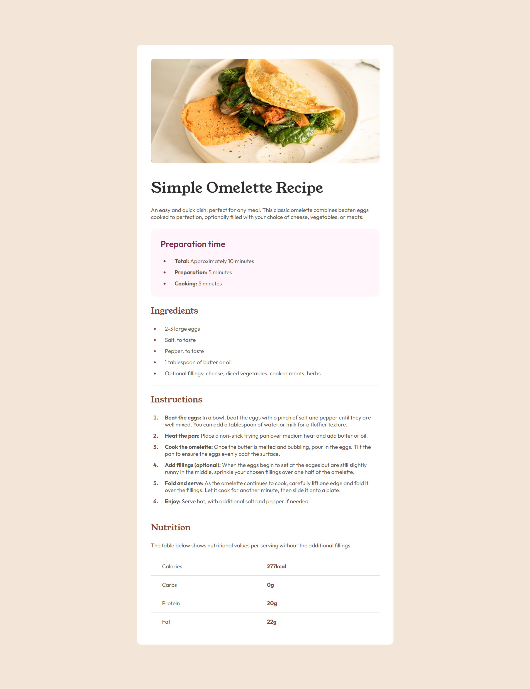

# Frontend Mentor - Recipe page solution

This is a solution to the [Recipe page challenge on Frontend Mentor](https://www.frontendmentor.io/challenges/recipe-page-KiTsR8QQKm). Frontend Mentor challenges help you improve your coding skills by building realistic projects. 

## Table of contents

- [Overview](#overview)
  - [The challenge](#the-challenge)
  - [Screenshot](#screenshot)
  - [Links](#links)
- [My process](#my-process)
  - [Built with](#built-with)
  - [What I learned](#what-i-learned)
  - [Useful resources](#useful-resources)

**Note: Delete this note and update the table of contents based on what sections you keep.**

## Overview

### Screenshot

### Links

- Solution URL: [https://github.com/tttam0113/frontend-mentor-learning/tree/main/01_get-started/fm-recipe-page](https://github.com/tttam0113/frontend-mentor-learning/tree/main/01_get-started/fm-recipe-page)
- Live Site URL: [https://tttam0113.github.io/frontend-mentor-learning/01_get-started/fm-recipe-page/](https://tttam0113.github.io/frontend-mentor-learning/01_get-started/fm-recipe-page/)

## My process

### Built with

- Semantic HTML5 markup
- Flexbox
- CSS Grid
- Mobile-first workflow

### What I learned

During this challenge, I gained two key insights:

- **Semantic HTML5 Markup**: I discovered that using semantic elements greatly improves the structure and readability of a page, making it more meaningful and easier to navigate.

- **Lists**: Styling lists to match the design required extensive research. In the process, I learned a lot about different types of lists, such as unordered, ordered, and description lists (something I hadn’t explored before), as well as list styling, markers, and customization options.

### Useful resources

- [web.dev > learn > css > list](https://web.dev/learn/css/lists?continue=https%3A%2F%2Fweb.dev%2Flearn%2Fcss%23article-https%3A%2F%2Fweb.dev%2Flearn%2Fcss%2Flists) - This resource was invaluable for understanding the nuances of list styling.

- [HTML Element Reference](https://developer.mozilla.org/en-US/docs/Web/HTML/Element) -  A detailed reference covering nearly 100 semantic HTML elements.
